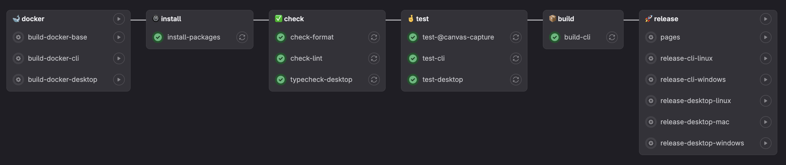

PBIs
- https://gitlab.com/msoe.edu/sdl/sdl/canvascapture/-/issues/104

### Pipline

### Jobs
- `build-docker-cli`: This job is used to build the Docker image for the CLI.
  - Optional: only run if docker image changed
- `install-packages`: This job is used to install the required packages for the workspace.
- `check-format`: This job is used to check the format of the code.
  - Requires: `install-packages`
- `check-lint`: This job is used to lint the code.
  - Requires: `install-packages`
- `test-cli`: This job is used to test the CLI.
  - Requires: `install-packages`, `check-format` & `check-lint`
- `build-cli`: This job is used to build the CLI.
  - Requires: `install-packages` & `test-cli`
- `release-cli-*`: This job is used to release a new version of the CLI.
  - Requires: `install-packages` & `build-cli`

### Releasing a new version 
- Create a new branch from the `main` branch
- Update the version in the `package.json` file
- Create new page in the documentation for the new version
- Push the branch to the remote repository
- Create a pull request to merge the branch into the `main` branch
- Merge the pull request
- Run the `release-cli-*` jobs in the GitLab CI/CD pipeline
- Upload the artifacts to the release bucket
