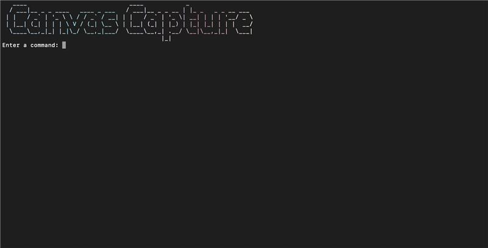
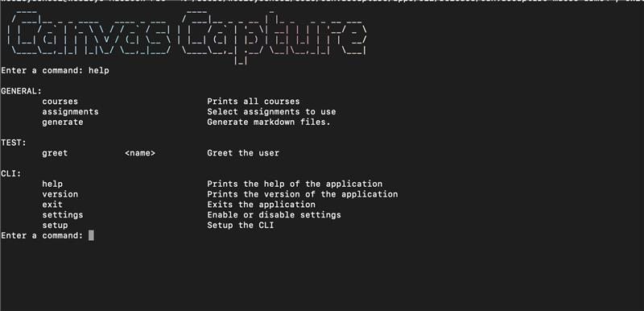
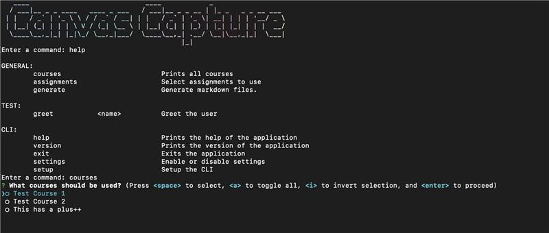
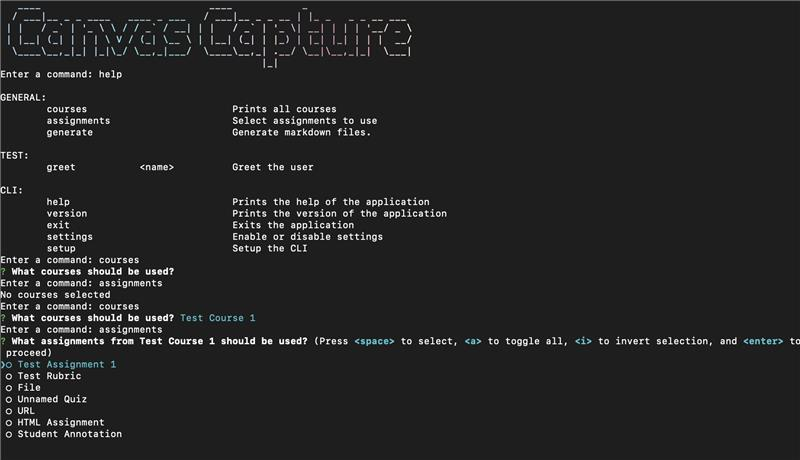

This is the Command Line Interface where you can capture work from the command line.
## Features 
### Start
This is the start of the CLI.

### Commands 
Below shows the list of commands that can be used in the CLI.

### Courses
When entering the command `courses` you will be able to see the list of courses that are available and select the courses you want to include in the generation process.

### Assignments
After selecting the courses you can then enter the 'assignment' command and select the assignments from the courses you selected in the previous step.

## Packages 

-   [Node.js](https://nodejs.org/en/) (v18.0.0 or later)