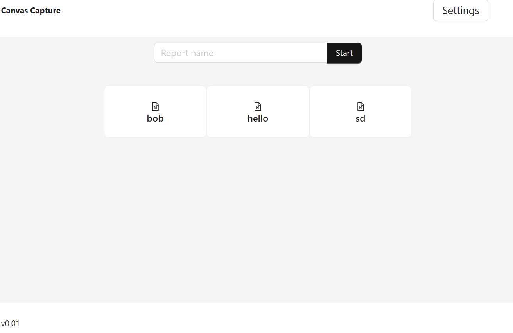
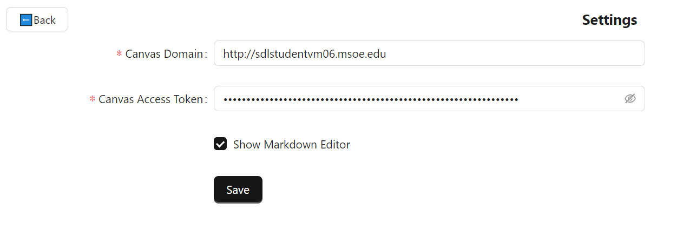
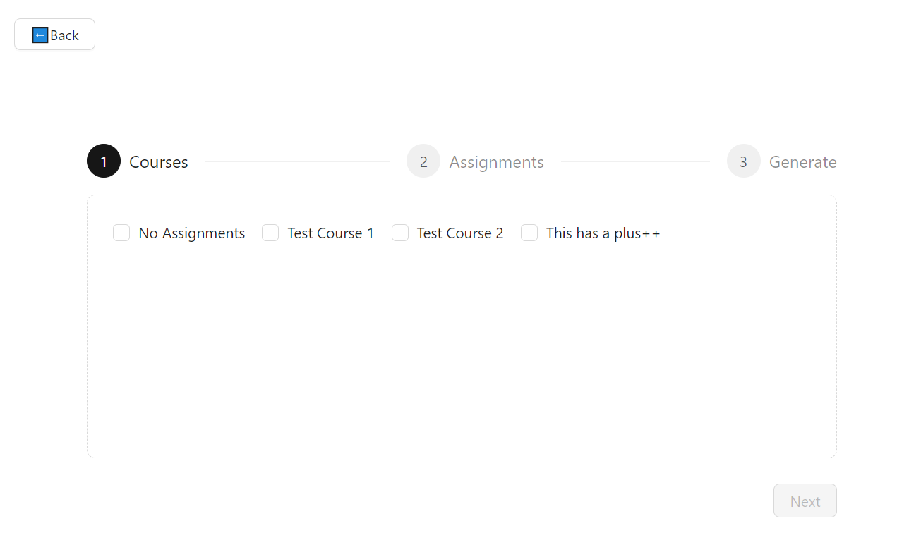
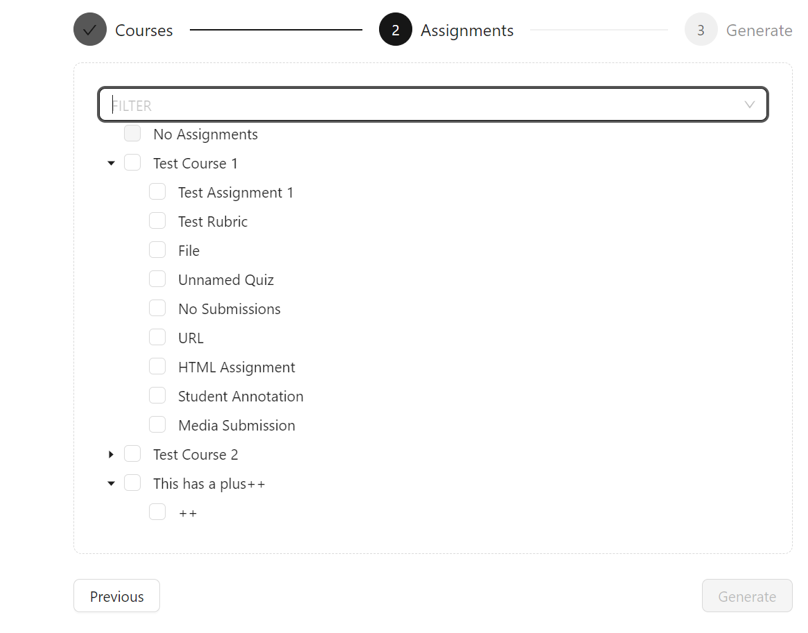
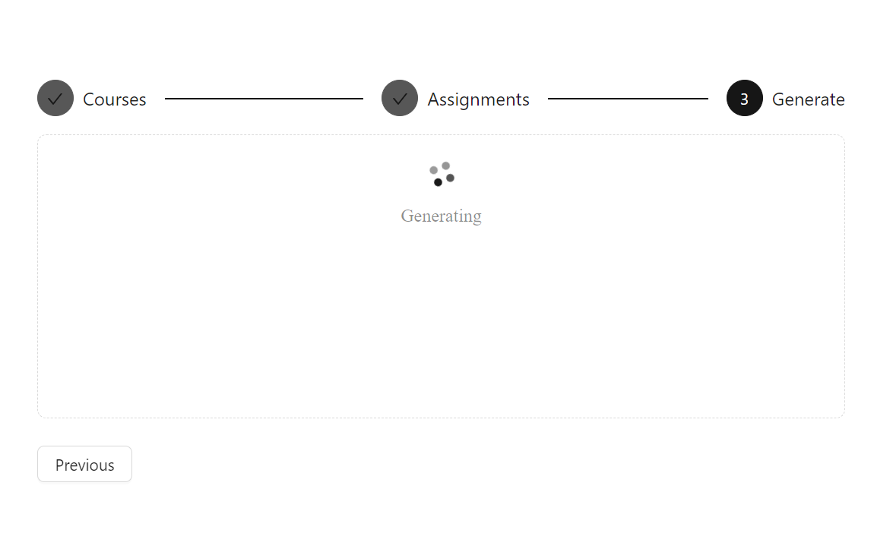

This is the desktop application. It can be installed on your computer. It supports windows, mac and linux. It is a GUI application that allows you to generate markdown files for your canvas assignments.

## Features
### Home page
This is the home page of the application. You view previous generations that you made or type in a name and start the generation process by pressing start.  

### Settings page
This is the settings page. From here you can enter your canvas domain and your API key. You will also be able to enable or disable the markdown editor tool.

### Course Selection 
This is the course selection page. Here you can select the courses you want to include in the generation process.

### Assignment Selection 
This is the assignment selection page. Here you can select the assignments from the courses you selected in the previous step. You can also filter your assignments by submission type using the filter selection

### Generation Page
This is the generation page. Here you can see the progress of the generation process. After it is finished it will lead you back to the homepage when you will see the file for the new generation

## Packages

-   [TanStack Router](https://tanstack.com/router/v1/docs/overview)
-   [Ant Design](https://ant.design/)
-   [Zustand](https://docs.pmnd.rs/zustand/getting-started/introduction)
-   [React Query](https://tanstack.com/query/latest/)
