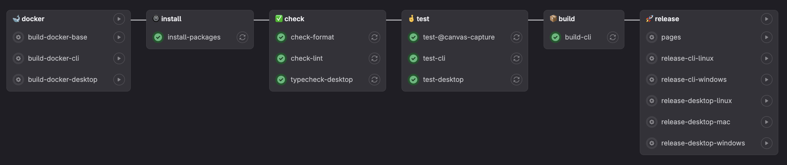

PBIs
- https://gitlab.com/msoe.edu/sdl/sdl/canvascapture/-/issues/104

### Pipline

### Jobs
- `install-packages`: This job is used to install the required packages for the workspace.
- `check-format`: This job is used to check the format of the code.
  - Requires: `install-packages`
- `check-lint`: This job is used to lint the code.
  - Requires: `install-packages`
- `pages`: This job is used to deploy the docs page.
  - Requires: `install-packages`
