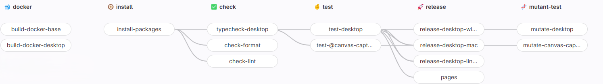

### Pipeline

### Jobs
- `build-docker-base`: This job is used to build the base Docker image.
    - Optional: only run if docker image changed
- `build-docker-desktop`: This job is used to build the Docker image for the Desktop.
  - Optional: only run if docker image changed
- `install-packages`: This job is used to install the required packages for the workspace.
- `typecheck-desktop`: This job is used to check for type errors.
  - Requires: `install-packages`
- `check-format`: This job is used to check the format of the code.
  - Requires: `install-packages`
- `check-lint`: This job is used to lint the code.
  - Requires: `install-packages`
- `test-desktop`: This job is used to test the Desktop.
  - Requires: `install-packages`
- `release-desktop-*`: These jobs are used to release a new version of the Desktop.
  - Requires: `install-packages`, `typecheck-desktop`, and `test-desktop`
- `mutate-desktop`: This job is used to run mutation testing on the Desktop.
  - Requires: `install-packages`, `typecheck-desktop`, and `test-desktop`
- `test-@canvas-capture`: This job is used to test the private module.
  - Requires: `install-packages`
- `mutate-canvas-capture`: This job is used to run mutation testing on the private module.
  - Requires: `install-packages` and `test-@canvas-capture`
- `pages`: This job is used to publish a new version of this documentation site.
  - Requires: `install-packages`

### Releasing a new version
- Create a new branch from the `main` branch
- Update the version in the `package.json` file
- Create new page in the documentation for the new version
- Push the branch to the remote repository
- Create a pull request to merge the branch into the `main` branch
- Merge the pull request
- Run the `release-desktop-*` jobs in the GitLab CI/CD pipeline
- Upload the artifacts to the release bucket
