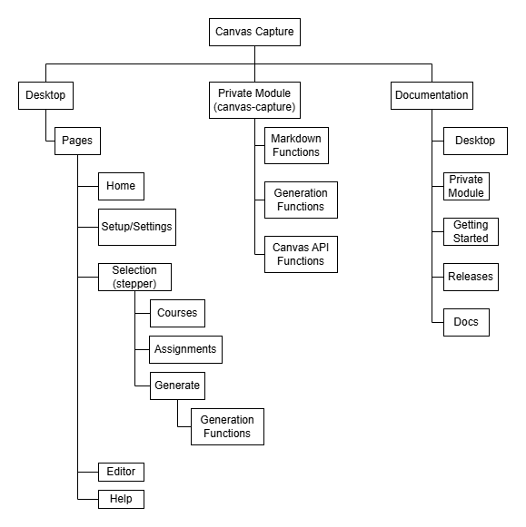

This project is a tool that allows users to capture their work on Canvas, an online learning platform, and generate a pdf file of their work. This feature is beneficial for professors who are undergoing a review process and want to showcase their work to the review committee. By using this tool, professors can easily document their Canvas activities, namely grading assignments and providing feedback. The tool also allows professors some ability to customize the content of the pdf file, such as fixing typos and including charts. The tool is designed to be user-friendly and compatible with various devices and browsers.

## Packages

Languages:
- [Typescript](https://www.typescriptlang.org/)

Package Managers:

-   [Pnpm](https://pnpm.io/)
-   [Nodejs](https://nodejs.org/en/)

Web Development:

-   [Canvas API](https://canvas.instructure.com/doc/api/index.html)
-   [Ant Design](https://ant.design/)

Containerization:

-   [Docker](https://www.docker.com/)

Continuous Integration/Continuous Deployment (CI/CD):

-   [Gitlab CI](https://docs.gitlab.com/ee/ci/)

## Project Structure

